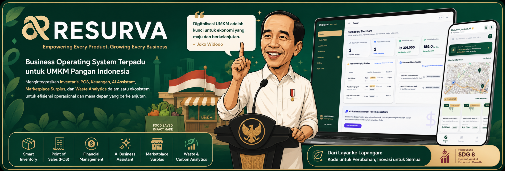
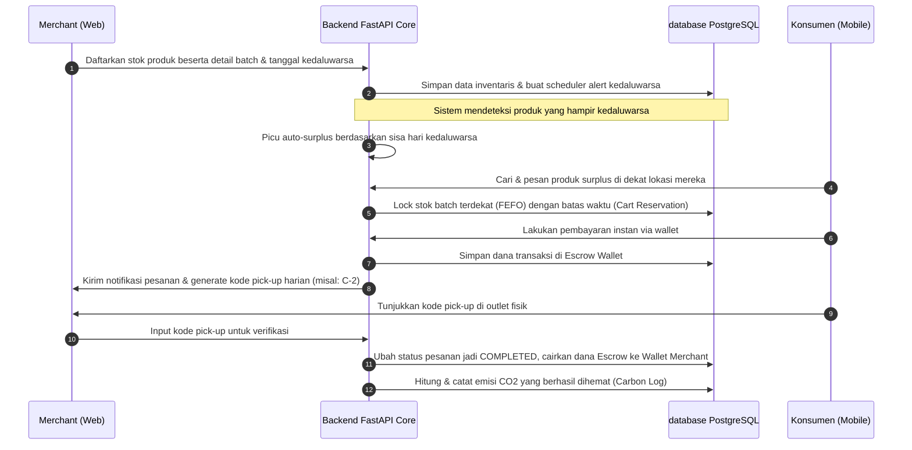

<div align="center">

# Resurva Backend APIs

**"Food waste is not just about emissions. It's about how much we value our food."**

[](https://fastapi.tiangolo.com/)
[](https://www.postgresql.org/)
[](https://www.sqlalchemy.org/)
[](https://alembic.sqlalchemy.org/)
[](https://polinema.ac.id/)
[](https://api.resurva.my.id/)

---



</div>

## 📌 Daftar Isi
1. [Tentang Resurva](#-tentang-resurva)
2. [Masalah yang Kami Lihat](#-masalah-yang-kami-lihat)
3. [Solusi yang Kami Tawarkan](#-solusi-yang-kami-tawarkan)
4. [Cara Kerja](#-cara-kerja)
5. [Fitur Utama](#-fitur-utama)
6. [Contoh Alur Penggunaan](#-contoh-alur-penggunaan)
7. [Dampak yang Ingin Dicapai](#-dampak-yang-ingin-dicapai)
8. [Teknologi](#-teknologi)
9. [Instalasi & Menjalankan Secara Lokal](#-instalasi--menjalankan-secara-lokal)
10. [Struktur Folder](#-struktur-folder)
11. [Demo](#-demo)
12. [Panduan Penggunaan / User Guide](#-panduan-penggunaan--user-guide)
13. [FAQ (Frequently Asked Questions)](#-faq-frequently-asked-questions)
14. [Roadmap](#-roadmap)
15. [Lisensi & Catatan Proyek](#-lisensi--catatan-proyek)

---

## 🍃 Tentang Resurva

**Resurva** adalah sebuah ekosistem solusi digital terintegrasi yang dirancang untuk mengatasi salah satu masalah lingkungan dan ketahanan pangan terbesar di dunia: **Food Waste** (Limbah Makanan). Mengusung arsitektur *Modular Monolith*, backend Resurva menyediakan API core berkinerja tinggi yang menghubungkan pemilik bisnis kuliner (UMKM hingga retail skala besar) dengan konsumen akhir secara instan, aman, dan efisien.

Melalui backend ini, berbagai data real-time dikelola secara terpusat untuk memberdayakan tiga platform utama:
1. **resurva_web (Smart Business Platform)**: Dashboard bagi pengelola bisnis untuk mengelola inventaris, memantau batch kedaluwarsa (FEFO), menganalisis omzet, melakukan audit limbah makanan, dan merumuskan strategi penanggulangan limbah.
2. **resurva_mobile**: Aplikasi pelanggan untuk mencari, memesan, dan membeli makanan surplus yang masih sangat layak konsumsi dengan harga diskon khusus.
3. **Resurva AI Assistant**: Kecerdasan buatan terintegrasi yang bertindak sebagai analis bisnis makro dan mikro, asisten visualisasi data (charts), serta konsultan strategi pemasaran berbasis tren real-time.

---

## ⚠️ Masalah yang Kami Lihat

Setiap tahunnya, tonan makanan yang masih layak konsumsi berakhir di tempat pembuangan akhir (TPA). Masalah ini dipicu oleh beberapa faktor krusial:
- **Lemahnya Pelacakan Kedaluwarsa (Expiry Tracking)**: Banyak toko makanan dan supermarket kesulitan melacak tanggal kedaluwarsa produk secara spesifik per batch. Akibatnya, barang kedaluwarsa sebelum sempat dipromosikan.
- **Kerugian Finansial UMKM**: Produk surplus yang tidak terjual langsung dibuang, menciptakan kerugian finansial bersih (lost revenue) bagi pelaku usaha.
- **Pemanasan Global**: Limbah makanan yang membusuk menghasilkan gas metana dan emisi karbon dioksida ($CO_2e$) yang mempercepat perubahan iklim.
- **Kesenjangan Pangan**: Sementara makanan dibuang, banyak masyarakat berpenghasilan rendah kesulitan mengakses makanan berkualitas dengan harga terjangkau.

---

## 💡 Solusi yang Kami Tawarkan

Backend Resurva dikembangkan untuk menjembatani celah operasional tersebut melalui pendekatan berbasis data dan otomatisasi cerdas:
* **FEFO-based Inventory Management**: Mengelola stok secara ketat berdasarkan batch tanggal kedaluwarsa terdekat.
* **Automated Expiry Alerts & Auto-Surplus**: Memberikan peringatan dini kepada seller dan otomatis menerbitkan produk sebagai menu surplus diskon ketika mendekati tanggal kedaluwarsa.
* **Escrow Wallet System**: Mengamankan transaksi pelanggan menggunakan sistem dompet digital dengan rekening bersama (escrow) terintegrasi, di mana dana hanya dilepaskan ke merchant setelah makanan sukses diambil menggunakan kode verifikasi unik.
* **Real-time Carbon Saved Tracker**: Mengkalkulasi emisi karbon ($CO_2e$) yang berhasil dihemat setiap kali makanan surplus diselamatkan.
* **AI Business Intelligence with MCP**: Integrasi AI (DeepSeek, OpenAI, Anthropic) dengan protokol Model Context Protocol (MCP) untuk analisis performa toko secara real-time, visualisasi grafik penjualan (Chart.js), dan strategi optimasi stok.

---

## ⚙️ Cara Kerja

Sistem mengelola siklus hidup produk dari masuknya stok di merchant hingga dibeli oleh konsumen akhir. Alur operasional sistem digambarkan dalam diagram berikut:



---

## 🚀 Fitur Utama

Sistem backend ini terbagi menjadi modul-modul independen yang kokoh (*Modular Monolith*):

* **🔐 Authentication & Authorization (Auth & Users)**: Registrasi dan login aman menggunakan JWT Access & Refresh Token. Mendukung kontrol akses berbasis peran (RBAC): `customer`, `seller`, `owner`, dan `admin`. Menyimpan titik koordinat (latitude & longitude) untuk pencarian outlet terdekat.
* **📦 FEFO Inventory Engine**: Pencatatan stok per batch (`inventory_batches`) lengkap dengan `batch_tag` unik dan tracking mutasi stok (`inventory_transactions`).
* **🛒 Cart & Reservation Manager**: Menghindari *overselling* makanan surplus yang terbatas dengan menerapkan pemesanan keranjang belanja dengan masa kedaluwarsa kunci stok (*cart stock lock timeout*).
* **💰 Escrow Wallet System**: Transaksi digital aman dengan pencatatan ledger transaksi (`wallet_transactions`) lengkap dengan sistem penahanan dana (`order_escrows`) demi perlindungan konsumen.
* **🍃 Carbon Tracker Engine**: Secara otomatis mengonversi berat makanan yang berhasil diselamatkan ke dalam satuan kilogram karbon dioksida yang dihindari ($kg\ CO_2e$).
* **📊 Enterprise Analytics**: Agregasi data komprehensif bagi pemilik bisnis multi-cabang (HQ) mencakup omzet, kerugian terhindari, total emisi terselamatkan, dan skor SDG.
* **🤖 AI Assistant Integration (dengan MCP Tools)**: Menyediakan endpoint chat pintar yang dapat mendeteksi intent pengguna, memanggil database secara dinamis melalui function calling (MCP), dan merender grafik visualisasi data (Chart.js) interaktif di sisi klien.
* **📝 Audit & Middleware Logging**: Middleware log sistem yang mencatat operasi sensitif, kegagalan autentikasi, serta performa response API untuk menjaga akuntabilitas sistem.

---

## 🔗 Contoh Alur Penggunaan

Berikut adalah contoh urutan endpoint API utama yang dipanggil saat melakukan siklus transaksi:

1. **Autentikasi Pengguna**:
   * POST `/api/v1/auth/register` (Registrasi pembeli atau penjual)
   * POST `/api/v1/auth/login` (Mendapatkan Access Token JWT)
2. **Pendaftaran Batch Inventaris (Oleh Penjual)**:
   * POST `/api/v1/inventory/` (Menambahkan batch stok baru beserta `expired_at`)
3. **Pemesanan Keranjang (Oleh Pembeli)**:
   * POST `/api/v1/cart/` (Memasukkan item ke keranjang dan mengunci stok sementara)
4. **Penyelesaian Order & Pembayaran**:
   * POST `/api/v1/orders/` (Membuat order, memicu penahanan dana di Escrow Wallet)
5. **Verifikasi & Penyelesaian (Oleh Penjual)**:
   * POST `/api/v1/orders/{order_id}/complete` (Memasukkan pick-up code, merilis dana escrow, mencatat emisi karbon terselamatkan)
6. **Konsultasi AI (Oleh Penjual/Owner)**:
   * POST `/api/v1/chat/` (Bertanya tentang analisis bisnis atau visualisasi grafik tren produk)

---

## 🎯 Dampak yang Ingin Dicapai

Backend Resurva menargetkan dampak keberlanjutan yang nyata:
1. **Dampak Lingkungan (SDG 13 - Climate Action)**: Menekan emisi gas rumah kaca akibat pembusukan limbah pangan organik di TPA.
2. **Kemandirian & Ketahanan Pangan (SDG 2 - Zero Hunger)**: Membantu mendistribusikan kelebihan pangan berkualitas kepada masyarakat yang membutuhkan dengan harga terjangkau.
3. **Produksi & Konsumsi Bertanggung Jawab (SDG 12 - Responsible Consumption & Production)**: Mengurangi kerugian pangan pada rantai pasok hilir melalui manajemen stok FEFO dan optimasi penjualan.

---

## 🛠️ Teknologi

Aplikasi dikembangkan menggunakan stack teknologi modern berkinerja tinggi:

* **Framework Utama**: [FastAPI](https://fastapi.tiangolo.com/) (Asynchronous Python Web Framework)
* **DBMS**: [PostgreSQL](https://www.postgresql.org/) (Relational Database)
* **Database Driver**: [Asyncpg](https://github.com/MagicStack/asyncpg) (Asynchronous PostgreSQL client)
* **ORM**: [SQLAlchemy 2.0](https://www.sqlalchemy.org/) (AsyncIO support)
* **Migrasi Database**: [Alembic](https://alembic.sqlalchemy.org/)
* **Validasi Data**: [Pydantic v2](https://docs.pydantic.dev/)
* **Keamanan**: [PyJWT](https://pyjwt.readthedocs.io/) & [Bcrypt](https://github.com/pyca/bcrypt)
* **HTTP Client**: [HTTPX](https://www.python-httpx.org/) (Untuk integrasi API AI & web crawling)
* **Sistem File/Storage**: Local Storage & AWS S3/MinIO Integration

---

## 💻 Instalasi & Menjalankan Secara Lokal

Ikuti langkah-langkah di bawah ini untuk menjalankan backend di server lokal Anda:

### 1. Klon Repositori
```bash
git clone https://github.com/Nexa-Code-Studio/resurva_backend.git
cd resurva_backend
```

### 2. Konfigurasi Environment Variables
Salin file `.env.example` menjadi `.env` dan sesuaikan nilainya (misalnya kredensial PostgreSQL Anda):
```bash
cp .env.example .env
```

### 3. Setup Virtual Environment & Dependensi
```bash
# Membuat virtual environment
python -m venv venv

# Aktivasi di Windows (PowerShell/CMD):
.\venv\Scripts\activate

# Aktivasi di Linux/macOS:
source venv/bin/activate

# Menginstal dependensi
pip install -r requirements.txt
```

### 4. Jalankan Migrasi Database
Pastikan layanan PostgreSQL Anda sudah menyala dan database yang ditentukan di file `.env` telah dibuat.
```bash
# Menjalankan migrasi database via Alembic
alembic upgrade head

# Menerapkan pembaruan skema & backfill data otomatis
python scripts/apply_schema_updates.py
```

### 5. Seeding Database (Opsional - Data Simulasi)
Untuk mengisi database dengan data dummy realistis yang lengkap (User, Bisnis, Cabang Toko, Produk, Transaksi, dan Riwayat Order):
```bash
python -m app.db.seeders.run
```

### 6. Jalankan Server Development
```bash
uvicorn app.main:app --reload --port 8000
```
Server akan berjalan di: [http://localhost:8000](http://localhost:8000)

---

## 📂 Struktur Folder

Aplikasi didesain menggunakan pendekatan Modular Monolith yang teratur:

```
resurva_backend/
├── app/
│   ├── ai/                # Integrasi penyedia LLM (OpenAI, Anthropic, DeepSeek)
│   ├── api/               # Router utama dan rute endpoints API v1
│   ├── core/              # Konfigurasi aplikasi, enums, middleware, dan setup logging
│   ├── db/                # Sesi koneksi database, base class, dan scripts seeders
│   ├── mcp/               # Registrasi tool Model Context Protocol untuk AI
│   ├── modules/           # Modul-modul bisnis domain-driven
│   │   ├── analytics/     # Enterprise analytics & forecasting
│   │   ├── auth/          # Autentikasi JWT & refresh tokens
│   │   ├── business/      # Entitas perusahaan induk / UMKM Group
│   │   ├── carbon/        # Log emisi karbon CO2e terselamatkan
│   │   ├── cart/          # Keranjang & stock lock reservation
│   │   ├── chat/          # Obrolan asisten AI & tool executor
│   │   ├── inventory/     # Manajemen batch barang FEFO & alerts
│   │   ├── orders/        # Pembuatan order & FEFO stock allocator
│   │   ├── products/      # Data katalog produk, sku, & komposisi bahan
│   │   ├── reviews/       # Rating dan feedback ulasan pelanggan
│   │   ├── stores/        # Data cabang outlet fisik toko & titik GPS
│   │   ├── wallets/       # Saldo dompet, riwayat transaksi, & escrow
│   │   └── users/         # Profil pengguna dan role-based metadata
│   ├── prompts/           # Kumpulan instruksi prompt AI
│   ├── storage/           # Layanan upload file (Lokal / S3 Cloud)
│   └── main.py            # Entrypoint utama inisialisasi FastAPI
├── assets/                # Aset gambar & ilustrasi dokumentasi
├── docs/                  # API specification dan desain dokumen tambahan
├── migrations/            # File migrasi skema database Alembic
├── scripts/               # Script mandiri untuk utilitas database & deployment
└── tests/                 # Unit dan integration testing (Pytest)
```

---

## 🌐 Demo

Backend Resurva telah dideploy secara aktif dan dapat diuji melalui tautan berikut:
- **Dokumentasi Swagger UI (API Docs)**: [https://api.resurva.my.id/docs](https://api.resurva.my.id/docs)
- **Dokumentasi Redoc**: [https://api.resurva.my.id/redoc](https://api.resurva.my.id/redoc)
- **Status API**: [https://api.resurva.my.id/](https://api.resurva.my.id/)

---

## 📘 Panduan Penggunaan / User Guide

Anda dapat berinteraksi langsung dengan API menggunakan **Swagger UI** yang tersedia di route `/docs`. 
1. Buka [https://api.resurva.my.id/docs](https://api.resurva.my.id/docs).
2. Lakukan registrasi menggunakan endpoint `/api/v1/auth/register` dengan menyertakan peran (`role`) yang sesuai:
   * `customer`: Mencari menu surplus, memesan barang, menggunakan wallet.
   * `seller`: Mengelola stok toko cabang, memasukkan kode pick-up transaksi.
   * `owner`: Mengelola data perusahaan induk, melihat visualisasi enterprise analytics lintas cabang.
3. Login melalui endpoint `/api/v1/auth/login` untuk mendapatkan access token.
4. Klik tombol **Authorize** di pojok kanan atas Swagger UI, masukkan token dengan format `Bearer <token_anda>`, lalu klik **Authorize**.
5. Sekarang Anda bebas memanggil seluruh endpoint terproteksi sesuai batas role Anda.

---

## ❓ FAQ (Frequently Asked Questions)

<details>
<summary><b>1. Apa itu Resurva Marketplace?</b></summary>
<p>

Resurva Marketplace adalah platform mobile berbasis lokasi yang memfasilitasi konsumen untuk membeli makanan surplus atau produk kuliner lezat yang mendekati masa kedaluwarsa dari toko, restoran, dan UMKM terdekat dengan harga yang jauh lebih murah.
</p>
</details>

<details>
<summary><b>2. Siapa saja yang dapat menggunakan aplikasi ini?</b></summary>
<p>

Semua kalangan dapat menggunakan aplikasi ini! Konsumen yang ingin mencari makanan berkualitas dengan harga terjangkau dapat menggunakan aplikasi mobile, sedangkan pemilik usaha makanan (toko, restoran, toko roti, dll.) dapat bergabung sebagai merchant menggunakan Smart Business Platform di web.
</p>
</details>

<details>
<summary><b>3. Bagaimana saya bisa tahu produk makanan surplus tersebut masih layak konsumsi?</b></summary>
<p>

Setiap produk makanan surplus yang terdaftar di Resurva wajib memenuhi standar kelayakan konsumsi dan kebersihan. Merchant berkewajiban mencantumkan tanggal serta jam kedaluwarsa (expiry batch) yang jelas, dan sistem FEFO kami memantau agar produk tidak dipajang melampaui batas aman.
</p>
</details>

<details>
<summary><b>4. Apakah ada batas minimal pembelian untuk setiap transaksi?</b></summary>
<p>

Tidak ada batas minimal pembelian. Anda dapat membeli satu porsi makanan surplus sekalipun untuk diselamatkan dari potensi terbuang.
</p>
</details>

<details>
<summary><b>5. Apa saja metode pembayaran yang didukung di aplikasi Resurva Mobile?</b></summary>
<p>

Kami mendukung pembayaran digital instan melalui sistem dompet elektronik (Wallet) bawaan Resurva yang terintegrasi langsung dengan mekanisme keamanan transaksi escrow.
</p>
</details>

<details>
<summary><b>6. Berapa radius maksimal pencarian produk dari lokasi saya berada?</b></summary>
<p>

Secara default, aplikasi mencari produk surplus dalam radius terdekat (misalnya hingga 10-15 km) dari titik koordinat GPS yang terdeteksi pada perangkat mobile Anda untuk memastikan makanan dapat diambil dalam kondisi optimal.
</p>
</details>

<details>
<summary><b>7. Bagaimana cara toko kuliner saya bergabung menjadi merchant Resurva?</b></summary>
<p>

Anda dapat mendaftar langsung di platform web Resurva, mengisi profil bisnis, mendaftarkan outlet/cabang, dan mengonfigurasikan jenis produk serta aturan auto-surplus untuk mulai menjual produk surplus Anda secara otomatis.
</p>
</details>

<details>
<summary><b>8. Ke mana saya harus melaporkan jika ada masalah dalam transaksi atau produk yang tidak layak?</b></summary>
<p>

Anda dapat menggunakan fitur Bantuan atau melaporkan langsung pesanan Anda melalui riwayat transaksi di aplikasi. Tim dukungan kami atau pengelola merchant akan segera memproses pengembalian dana melalui mekanisme refund escrow wallet jika terbukti terdapat ketidaksesuaian produk.
</p>
</details>

<details>
<summary><b>9. Kenapa inventarisasi di Resurva didekati dengan model batch kedaluwarsa?</b></summary>
<p>

Produk makanan segar memiliki masa simpan yang dinamis. Dengan mendaftarkan produk per batch kedaluwarsa, backend dapat menerapkan prinsip FEFO (First-Expired-First-Out) saat pembeli melakukan reservasi keranjang, memastikan makanan dengan umur simpan terpendek terjual lebih dahulu untuk meminimalisir potensi terbuang.
</p>
</details>

<details>
<summary><b>10. Bagaimana sistem mengamankan transaksi antara pembeli dan penjual?</b></summary>
<p>

Kami mengimplementasikan sistem **Escrow Wallet**. Dana yang dibayarkan oleh pembeli akan langsung dipindahkan ke rekening escrow sistem dan ditahan sementara. Setelah pembeli menunjukkan kode pick-up fisik dan penjual memvalidasi lewat aplikasi, status order berubah menjadi `COMPLETED` dan dana akan otomatis ditransfer ke dompet utama penjual. Jika order dibatalkan atau kedaluwarsa sebelum diambil, dana otomatis dikembalikan 100% ke saldo pembeli.
</p>
</details>

<details>
<summary><b>11. Apakah asisten AI dapat memodifikasi atau menghapus data inventaris saya?</b></summary>
<p>

Tidak. Untuk alasan keamanan, asisten AI dirancang dengan prinsip *read-only*. AI hanya dapat memanggil *read-only tool* untuk mencari produk, membaca grafik performa, dan merumuskan strategi penanggulangan limbah. Segala bentuk perubahan data (seperti pembuatan order, penghapusan produk, atau pencairan saldo) wajib dilakukan secara manual lewat interaksi API standar yang membutuhkan autentikasi pengguna secara langsung.
</p>
</details>

---

## 🗺️ Roadmap

Berikut rencana pengembangan sistem backend Resurva ke depan:
- [ ] **Machine Learning Stock Forecasting**: Mengintegrasikan algoritma peramalan untuk memprediksi potensi kelebihan stok bahan pangan mentah berdasarkan tren historis sebelum kedaluwarsa.
- [ ] **Dynamic Auto-Pricing Engine**: Penyesuaian diskon otomatis secara dinamis berdasar sisa jam kedaluwarsa produk (semakin mepet, diskon bertambah secara aman).
- [ ] **Logistics Delivery APIs Integration**: Menghubungkan platform dengan API pengiriman instan pihak ketiga (3PL) untuk memfasilitasi pengantaran makanan surplus langsung ke rumah pembeli.
- [ ] **Exportable PDF/Excel Reports Generator**: Ekspor laporan keuangan, audit limbah makanan, dan laporan emisi karbon ke format PDF atau Excel.

---

## 👥 Tim NexaCode

Proyek ini dibangun oleh **Tim NexaCode** dari Politeknik Negeri Malang untuk menghadirkan solusi teknologi yang memberikan dampak sosial-lingkungan berkelanjutan bagi Indonesia.

---

## 📄 Lisensi & Catatan Proyek

Sistem ini dikembangkan khusus sebagai bagian dari keikutsertaan kompetisi **BytesFest 2026** di Politeknik Negeri Malang oleh Tim **NexaCode**. Proyek ini bertujuan untuk menciptakan solusi nyata berbasis teknologi bagi kelestarian lingkungan dan ketahanan pangan nasional.

- **Lisensi**: Proprietary (BytesFest 2026)
- **Hak Cipta**: &copy; 2026 NexaCode. All rights reserved.
- **Tautan Repositori Terkait**:
  - [resurva_web (Smart Business Platform)](https://github.com/Nexa-Code-Studio/resurva_web)
  - [resurva_backend (FastAPI core APIs)](https://github.com/Nexa-Code-Studio/resurva_backend)
  - [resurva_mobile](https://github.com/Nexa-Code-Studio/resurva_mobile)


---

<div align="center">
    Made with ❤️ by <b>NexaCode Team</b> for a Sustainable Future 🌿
</div>
