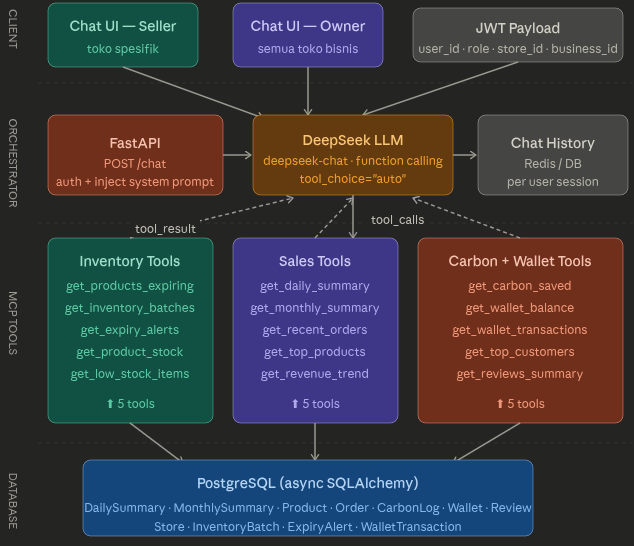

Oke, jadi kamu sudah punya basic-nya. Sekarang aku akan bantu kamu upgrade ke sistem yang proper. Mari kita bagi jadi beberapa bagian yang bisa kamu implementasikan secara bertahap.

Berikut arsitektur lengkap yang akan kita bangun:
Oke, sekarang aku buat diagram arsitektur lengkapnya dulu, kemudian kita breakdown implementasinya.

Sekarang kita breakdown implementasinya bagian per bagian. Ada 4 komponen utama yang perlu kamu buat/upgrade:

---

## 1. System Prompt Builder (role-based)

Ini bagian paling penting — sistem prompt yang di-inject berbeda tergantung role:

```python
# app/chatbot/prompts.py

def build_system_prompt(user: User, store: Store | None, business: Business | None) -> str:
    base = """Kamu adalah asisten bisnis untuk platform Food Waste Marketplace.
Kamu HANYA bisa membaca data dan memberikan rekomendasi. Kamu TIDAK bisa mengubah data apapun.
Selalu jawab dalam Bahasa Indonesia. Gunakan angka konkret dari data yang tersedia.
Jika data tidak tersedia, katakan dengan jelas dan jangan mengarang."""

    if user.role == "seller":
        return base + f"""

KONTEKS: Kamu membantu SELLER dari toko "{store.name}" (store_id: {store.id}).
- Kamu HANYA boleh melihat data toko ini, bukan toko lain
- Fokus pada: stok, produk hampir expired, omzet harian, review pelanggan
- Berikan rekomendasi actionable (misal: "diskon produk X karena expired 2 hari lagi")
- Jangan tampilkan data financial sensitif seperti detail wallet"""

    elif user.role == "owner":
        store_list = ", ".join([f'"{s.name}"' for s in business.stores])
        return base + f"""

KONTEKS: Kamu membantu OWNER bisnis "{business.name}" (business_id: {business.id}).
- Kamu bisa melihat semua toko: {store_list}
- Fokus pada: perbandingan performa antar toko, tren revenue, carbon impact keseluruhan
- Bisa melihat data wallet dan transaksi
- Berikan insight strategis level bisnis"""

    return base
```

---

## 2. Tool Definitions untuk DeepSeek

```python
# app/chatbot/tools.py

def get_tools_for_role(role: str) -> list[dict]:
    """Return tool definitions yang sesuai role."""
    
    common_tools = [
        {
            "type": "function",
            "function": {
                "name": "get_daily_summary",
                "description": "Ambil ringkasan harian toko: total order, revenue, carbon saved, alert expired. Gunakan untuk pertanyaan tentang performa hari ini atau tanggal tertentu.",
                "parameters": {
                    "type": "object",
                    "properties": {
                        "store_id": {"type": "string", "description": "UUID toko"},
                        "date": {"type": "string", "description": "Format YYYY-MM-DD, default hari ini"}
                    },
                    "required": ["store_id"]
                }
            }
        },
        {
            "type": "function",
            "function": {
                "name": "get_products_expiring",
                "description": "Cari produk yang akan expired dalam N hari ke depan atau sudah expired. Gunakan untuk rekomendasi diskon/promosi.",
                "parameters": {
                    "type": "object",
                    "properties": {
                        "store_id": {"type": "string"},
                        "days_ahead": {"type": "integer", "description": "Jumlah hari ke depan, default 3"},
                        "include_expired": {"type": "boolean", "default": False}
                    },
                    "required": ["store_id"]
                }
            }
        },
        {
            "type": "function",
            "function": {
                "name": "get_monthly_summary",
                "description": "Ringkasan bulanan: revenue, order, customer baru, avg rating, carbon. Gunakan untuk pertanyaan 'bulan ini', 'bulan lalu', atau perbandingan bulanan.",
                "parameters": {
                    "type": "object",
                    "properties": {
                        "store_id": {"type": "string"},
                        "year": {"type": "integer"},
                        "month": {"type": "integer", "description": "1-12"}
                    },
                    "required": ["store_id", "year", "month"]
                }
            }
        },
        {
            "type": "function",
            "function": {
                "name": "get_top_products",
                "description": "Produk terlaris berdasarkan jumlah terjual. Gunakan untuk pertanyaan tentang produk populer atau rekomendasi stok.",
                "parameters": {
                    "type": "object",
                    "properties": {
                        "store_id": {"type": "string"},
                        "limit": {"type": "integer", "default": 5},
                        "period_days": {"type": "integer", "description": "N hari terakhir, default 30"}
                    },
                    "required": ["store_id"]
                }
            }
        },
        {
            "type": "function",
            "function": {
                "name": "get_carbon_saved",
                "description": "Total karbon yang berhasil diselamatkan dari pembuangan. Gunakan untuk pertanyaan tentang dampak lingkungan.",
                "parameters": {
                    "type": "object",
                    "properties": {
                        "store_id": {"type": "string"},
                        "period": {"type": "string", "enum": ["today", "week", "month", "all"], "default": "month"}
                    },
                    "required": ["store_id"]
                }
            }
        },
        {
            "type": "function",
            "function": {
                "name": "get_low_stock_items",
                "description": "Produk dengan stok menipis (di bawah threshold). Gunakan untuk rekomendasi restok.",
                "parameters": {
                    "type": "object",
                    "properties": {
                        "store_id": {"type": "string"},
                        "threshold": {"type": "integer", "description": "Stok minimum, default 5"}
                    },
                    "required": ["store_id"]
                }
            }
        },
        {
            "type": "function",
            "function": {
                "name": "get_reviews_summary",
                "description": "Ringkasan review toko: rata-rata rating, review terbaru, label paling sering muncul.",
                "parameters": {
                    "type": "object",
                    "properties": {
                        "store_id": {"type": "string"},
                        "limit": {"type": "integer", "default": 5}
                    },
                    "required": ["store_id"]
                }
            }
        },
    ]
    
    # Owner-only tools
    owner_tools = [
        {
            "type": "function",
            "function": {
                "name": "get_wallet_balance",
                "description": "Cek saldo wallet dan transaksi terbaru toko.",
                "parameters": {
                    "type": "object",
                    "properties": {
                        "store_id": {"type": "string"},
                        "include_transactions": {"type": "boolean", "default": False}
                    },
                    "required": ["store_id"]
                }
            }
        },
        {
            "type": "function",
            "function": {
                "name": "get_business_overview",
                "description": "Ringkasan semua toko dalam satu bisnis: perbandingan revenue, rating, carbon. Khusus untuk owner yang punya multiple stores.",
                "parameters": {
                    "type": "object",
                    "properties": {
                        "business_id": {"type": "string"},
                        "period": {"type": "string", "enum": ["today", "week", "month"], "default": "month"}
                    },
                    "required": ["business_id"]
                }
            }
        },
    ]
    
    if role == "owner":
        return common_tools + owner_tools
    return common_tools
```

---

## 3. Tool Executor (MCP layer — async SQLAlchemy)

```python
# app/chatbot/mcp_executor.py
import json
from datetime import date, timedelta
from sqlalchemy import select, func, and_
from sqlalchemy.ext.asyncio import AsyncSession

from app.models import (
    DailySummary, MonthlySummary, Product, Order, OrderItem,
    CarbonLog, Wallet, WalletTransaction, Review, Store, InventoryBatch
)

class MCPExecutor:
    def __init__(self, db: AsyncSession, user_store_ids: list[str], business_id: str | None):
        self.db = db
        # Security: hanya store yang boleh diakses user ini
        self.allowed_store_ids = set(user_store_ids)
        self.business_id = business_id

    def _check_store_access(self, store_id: str) -> None:
        """Guard: pastikan store_id termasuk yang boleh diakses."""
        if store_id not in self.allowed_store_ids:
            raise PermissionError(f"Akses ditolak ke store {store_id}")

    async def execute(self, tool_name: str, arguments: dict) -> str:
        """Dispatch tool call ke method yang sesuai."""
        try:
            handler = getattr(self, f"_tool_{tool_name}", None)
            if not handler:
                return json.dumps({"error": f"Tool '{tool_name}' tidak ditemukan"})
            result = await handler(**arguments)
            return json.dumps(result, default=str)
        except PermissionError as e:
            return json.dumps({"error": str(e)})
        except Exception as e:
            return json.dumps({"error": f"Gagal mengambil data: {str(e)}"})

    async def _tool_get_daily_summary(self, store_id: str, date: str = None) -> dict:
        self._check_store_access(store_id)
        target_date = date or str(date.today())
        
        result = await self.db.execute(
            select(DailySummary).where(
                and_(DailySummary.store_id == store_id,
                     DailySummary.summary_date == target_date)
            )
        )
        row = result.scalar_one_or_none()
        if not row:
            return {"message": f"Belum ada data untuk tanggal {target_date}"}
        
        return {
            "date": str(row.summary_date),
            "total_orders": row.total_orders,
            "total_revenue": row.total_revenue,
            "total_discount_given": row.total_discount_given,
            "items_sold": row.items_sold,
            "carbon_saved_kg": round(row.carbon_saved_kg, 2),
            "expiry_alerts_count": row.expiry_alerts_count
        }

    async def _tool_get_products_expiring(
        self, store_id: str, days_ahead: int = 3, include_expired: bool = False
    ) -> dict:
        self._check_store_access(store_id)
        now = date.today()
        cutoff = now + timedelta(days=days_ahead)
        
        q = select(Product).where(
            and_(Product.store_id == store_id, Product.stock > 0)
        )
        if include_expired:
            q = q.where(Product.expired_at <= cutoff)
        else:
            q = q.where(
                and_(Product.expired_at > now, Product.expired_at <= cutoff)
            )
        
        result = await self.db.execute(q.order_by(Product.expired_at))
        products = result.scalars().all()
        
        return {
            "count": len(products),
            "products": [
                {
                    "name": p.name,
                    "stock": p.stock,
                    "expired_at": str(p.expired_at),
                    "days_left": (p.expired_at.date() - now).days,
                    "discounted_price": p.discounted_price,
                    "original_price": p.original_price,
                }
                for p in products
            ]
        }

    async def _tool_get_monthly_summary(
        self, store_id: str, year: int, month: int
    ) -> dict:
        self._check_store_access(store_id)
        result = await self.db.execute(
            select(MonthlySummary).where(
                and_(MonthlySummary.store_id == store_id,
                     MonthlySummary.year == year,
                     MonthlySummary.month == month)
            )
        )
        row = result.scalar_one_or_none()
        if not row:
            return {"message": f"Belum ada data untuk {year}-{month:02d}"}
        
        return {
            "period": f"{year}-{month:02d}",
            "total_orders": row.total_orders,
            "total_revenue": row.total_revenue,
            "total_discount_given": row.total_discount_given,
            "new_customers": row.new_customers,
            "carbon_saved_kg": round(row.carbon_saved_kg, 2),
            "avg_rating": round(row.avg_rating, 1)
        }

    async def _tool_get_top_products(
        self, store_id: str, limit: int = 5, period_days: int = 30
    ) -> dict:
        self._check_store_access(store_id)
        since = date.today() - timedelta(days=period_days)
        
        result = await self.db.execute(
            select(Product.name, func.sum(OrderItem.quantity).label("total_sold"))
            .join(OrderItem, OrderItem.product_id == Product.id)
            .join(Order, Order.id == OrderItem.order_id)
            .where(
                and_(Product.store_id == store_id,
                     Order.created_at >= since,
                     Order.status == "completed")
            )
            .group_by(Product.id, Product.name)
            .order_by(func.sum(OrderItem.quantity).desc())
            .limit(limit)
        )
        rows = result.all()
        return {
            "period_days": period_days,
            "products": [{"name": r.name, "total_sold": r.total_sold} for r in rows]
        }

    async def _tool_get_carbon_saved(
        self, store_id: str, period: str = "month"
    ) -> dict:
        self._check_store_access(store_id)
        now = date.today()
        period_map = {
            "today": now,
            "week": now - timedelta(days=7),
            "month": now.replace(day=1),
            "all": None
        }
        since = period_map.get(period)
        
        q = select(func.sum(CarbonLog.carbon_saved_kg)).join(
            Order, Order.id == CarbonLog.order_id
        ).where(Order.store_id == store_id)
        if since:
            q = q.where(CarbonLog.created_at >= since)
        
        result = await self.db.execute(q)
        total = result.scalar() or 0
        
        return {
            "period": period,
            "carbon_saved_kg": round(total, 2),
            "equivalent_trees": round(total / 21.77, 1)  # 1 pohon ~21.77 kg CO2/tahun
        }

    async def _tool_get_low_stock_items(
        self, store_id: str, threshold: int = 5
    ) -> dict:
        self._check_store_access(store_id)
        result = await self.db.execute(
            select(Product)
            .where(
                and_(Product.store_id == store_id,
                     Product.stock <= threshold,
                     Product.stock > 0)
            )
            .order_by(Product.stock)
        )
        products = result.scalars().all()
        return {
            "count": len(products),
            "threshold": threshold,
            "products": [
                {"name": p.name, "stock": p.stock, "product_type": p.product_type}
                for p in products
            ]
        }

    async def _tool_get_reviews_summary(
        self, store_id: str, limit: int = 5
    ) -> dict:
        self._check_store_access(store_id)
        avg_result = await self.db.execute(
            select(func.avg(Review.rating), func.count(Review.id))
            .where(Review.store_id == store_id)
        )
        avg_rating, total_count = avg_result.one()
        
        recent_result = await self.db.execute(
            select(Review)
            .where(Review.store_id == store_id)
            .order_by(Review.created_at.desc())
            .limit(limit)
        )
        reviews = recent_result.scalars().all()
        
        return {
            "avg_rating": round(avg_rating or 0, 1),
            "total_reviews": total_count,
            "recent_reviews": [
                {"rating": r.rating, "label": r.label, "snippet": r.description[:100]}
                for r in reviews
            ]
        }

    async def _tool_get_wallet_balance(
        self, store_id: str, include_transactions: bool = False
    ) -> dict:
        self._check_store_access(store_id)
        result = await self.db.execute(
            select(Wallet).where(Wallet.store_id == store_id)
        )
        wallet = result.scalar_one_or_none()
        if not wallet:
            return {"message": "Wallet belum ada"}
        
        data = {"balance": wallet.balance, "updated_at": str(wallet.updated_at)}
        
        if include_transactions:
            txn_result = await self.db.execute(
                select(WalletTransaction)
                .where(WalletTransaction.wallet_id == wallet.id)
                .order_by(WalletTransaction.created_at.desc())
                .limit(5)
            )
            txns = txn_result.scalars().all()
            data["recent_transactions"] = [
                {"type": t.type, "amount": t.amount, "note": t.note}
                for t in txns
            ]
        return data

    async def _tool_get_business_overview(
        self, business_id: str, period: str = "month"
    ) -> dict:
        if business_id != self.business_id:
            raise PermissionError("Akses ditolak ke business ini")
        
        now = date.today()
        year, month = now.year, now.month
        
        result = await self.db.execute(
            select(
                Store.name,
                MonthlySummary.total_revenue,
                MonthlySummary.total_orders,
                MonthlySummary.avg_rating,
                MonthlySummary.carbon_saved_kg
            )
            .join(MonthlySummary, MonthlySummary.store_id == Store.id)
            .where(
                and_(Store.business_id == business_id,
                     MonthlySummary.year == year,
                     MonthlySummary.month == month)
            )
        )
        rows = result.all()
        return {
            "period": f"{year}-{month:02d}",
            "stores": [
                {
                    "name": r.name,
                    "revenue": r.total_revenue,
                    "orders": r.total_orders,
                    "avg_rating": round(r.avg_rating, 1),
                    "carbon_saved_kg": round(r.carbon_saved_kg, 2)
                }
                for r in rows
            ]
        }
```

---

## 4. Chat Endpoint (menggabungkan semua)

```python
# app/chatbot/router.py
from fastapi import APIRouter, Depends, HTTPException
from sqlalchemy.ext.asyncio import AsyncSession
from openai import AsyncOpenAI  # DeepSeek kompatibel OpenAI SDK
import json

from app.db import get_db
from app.auth import get_current_user
from app.chatbot.prompts import build_system_prompt
from app.chatbot.tools import get_tools_for_role
from app.chatbot.mcp_executor import MCPExecutor
from app.chatbot.history import get_history, save_history  # implementasi kamu

router = APIRouter(prefix="/chat", tags=["chatbot"])

deepseek = AsyncOpenAI(
    api_key="your-deepseek-key",
    base_url="https://api.deepseek.com"
)

@router.post("")
async def chat(
    payload: ChatRequest,
    db: AsyncSession = Depends(get_db),
    current_user = Depends(get_current_user)
):
    # Ambil context user
    store = current_user.store  # dari relationship
    business = current_user.business
    
    # Bangun allowed_store_ids berdasarkan role
    if current_user.role == "seller":
        allowed_store_ids = [str(current_user.store_id)]
    elif current_user.role == "owner":
        allowed_store_ids = [str(s.id) for s in business.stores]
    else:
        raise HTTPException(403, "Role tidak diizinkan menggunakan chatbot")
    
    # System prompt + tools sesuai role
    system_prompt = build_system_prompt(current_user, store, business)
    tools = get_tools_for_role(current_user.role)
    
    # Ambil history sebelumnya
    history = await get_history(current_user.id, payload.session_id, db)
    history.append({"role": "user", "content": payload.message})
    
    # Agentic loop: biarkan DeepSeek memanggil tools sebanyak perlu
    executor = MCPExecutor(db, allowed_store_ids, str(business.id) if business else None)
    messages = history.copy()
    
    MAX_ITERATIONS = 5  # cegah loop tak terbatas
    for _ in range(MAX_ITERATIONS):
        response = await deepseek.chat.completions.create(
            model="deepseek-chat",
            messages=[{"role": "system", "content": system_prompt}] + messages,
            tools=tools,
            tool_choice="auto",
            max_tokens=1024
        )
        
        msg = response.choices[0].message
        messages.append(msg.model_dump(exclude_none=True))
        
        # Jika tidak ada tool call → selesai, kembalikan jawaban
        if not msg.tool_calls:
            break
        
        # Eksekusi semua tool calls secara parallel
        tool_results = []
        for tc in msg.tool_calls:
            args = json.loads(tc.function.arguments)
            result = await executor.execute(tc.function.name, args)
            tool_results.append({
                "role": "tool",
                "tool_call_id": tc.id,
                "content": result
            })
        messages.extend(tool_results)
    
    final_answer = messages[-1]["content"] if not msg.tool_calls else "Maaf, gagal mendapatkan jawaban."
    
    # Simpan history (hanya user + assistant messages, bukan tool internals)
    await save_history(current_user.id, payload.session_id, history + [
        {"role": "assistant", "content": final_answer}
    ], db)
    
    return {"reply": final_answer, "session_id": payload.session_id}
```

---

## Hal-hal Penting yang Perlu Diperhatikan

**Security:** Setiap tool call harus lewat `_check_store_access()` — jangan sampai seller bisa query store lain hanya dengan mengirim store_id berbeda.

**Agentic loop:** DeepSeek mungkin perlu memanggil 2–3 tools sekaligus (misal: cek expired → cek summary → baru jawab). Loop `MAX_ITERATIONS = 5` mencegah infinite loop kalau ada bug di prompt.

**`description` di tool definitions itu kunci.** DeepSeek memutuskan kapan pakai tool mana berdasarkan description-nya. Tulis sejelas mungkin kapan tool itu dipakai dan apa yang dikembalikannya.

**Chat history:** Untuk MVP, bisa simpan di tabel `ChatSession` di DB. Untuk produksi, Redis lebih baik karena cepat dan bisa set TTL otomatis per session.

Mau aku lanjutkan ke bagian mana dulu? Bisa ke implementasi **chat history storage**, **streaming response** (SSE supaya UI lebih responsif), atau **unit test untuk MCP tools**?